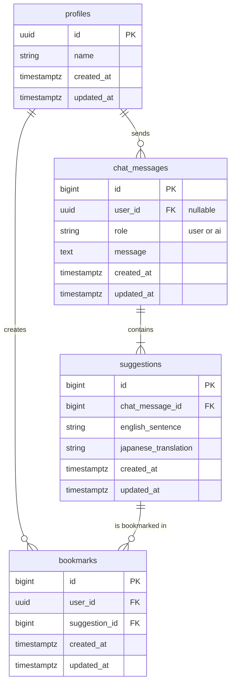

# DB 設計書

本ドキュメントは、AI チャット英語学習システムのデータベース設計を定義します。
`要件定義書.md` に基づき、システムが必要とするデータを永続化するためのテーブル構造を設計します。

## 1. 設計思想

- **正規化**: データの冗長性を排除し、一貫性を保つために正規化を意識した設計とします。
- **拡張性**: 将来的な機能追加（多言語対応、複数ユーザー対応など）を考慮し、スケールしやすい構造を目指します。
- **シンプルさ**: 初期開発においては、要件を過不足なく満たすシンプルな設計を心がけます。

## 2. ER 図

## 3. テーブル定義

### 3.1. `profiles` テーブル

Supabase の認証ユーザー (`auth.users`) に紐づく、アプリケーション固有のユーザー情報を格納します。

| カラム名     | データ型       | 制約                                                         | 説明                                                                                    |
| :----------- | :------------- | :----------------------------------------------------------- | :-------------------------------------------------------------------------------------- |
| `id`         | `UUID`         | `PRIMARY KEY`, `REFERENCES auth.users(id) ON DELETE CASCADE` | `auth.users` テーブルの ID を参照する。ユーザー削除時にプロフィールも自動で削除される。 |
| `name`       | `VARCHAR(255)` |                                                              | ユーザーの表示名                                                                        |
| `created_at` | `TIMESTAMPTZ`  | `NOT NULL`, `DEFAULT now()`                                  | 作成日時                                                                                |
| `updated_at` | `TIMESTAMPTZ`  | `NOT NULL`, `DEFAULT now()`                                  | 更新日時                                                                                |

### 3.2. `chat_messages` テーブル

ユーザーと AI の対話履歴を格納します。

| カラム名     | データ型      | 制約                                              | 説明                                            |
| :----------- | :------------ | :------------------------------------------------ | :---------------------------------------------- |
| `id`         | `BIGINT`      | `PRIMARY KEY`, `GENERATED BY DEFAULT AS IDENTITY` | メッセージを一意に識別する ID                   |
| `user_id`    | `UUID`        | `FK (auth.users.id)`                              | 発言したユーザーの ID。AI の発言の場合は `NULL` |
| `role`       | `VARCHAR(50)` | `NOT NULL`                                        | 発言者の役割 (`'user'` or `'ai'`)               |
| `message`    | `TEXT`        | `NOT NULL`                                        | メッセージ本文                                  |
| `created_at` | `TIMESTAMPTZ` | `NOT NULL`, `DEFAULT now()`                       | 作成日時                                        |
| `updated_at` | `TIMESTAMPTZ` | `NOT NULL`, `DEFAULT now()`                       | 更新日時                                        |

### 3.3. `suggestions` テーブル

AI が生成した英語表現の提案を格納します。1 つの AI メッセージ (`chat_messages`) に対して複数の提案が紐付きます。

| カラム名               | データ型      | 制約                                              | 説明                                  |
| :--------------------- | :------------ | :------------------------------------------------ | :------------------------------------ |
| `id`                   | `BIGINT`      | `PRIMARY KEY`, `GENERATED BY DEFAULT AS IDENTITY` | 提案を一意に識別する ID               |
| `chat_message_id`      | `BIGINT`      | `FK (chat_messages.id)`, `NOT NULL`               | この提案が含まれる AI メッセージの ID |
| `english_sentence`     | `TEXT`        | `NOT NULL`                                        | 英語の例文                            |
| `japanese_translation` | `TEXT`        | `NOT NULL`                                        | 例文の日本語訳                        |
| `created_at`           | `TIMESTAMPTZ` | `NOT NULL`, `DEFAULT now()`                       | 作成日時                              |
| `updated_at`           | `TIMESTAMPTZ` | `NOT NULL`, `DEFAULT now()`                       | 更新日時                              |

### 3.4. `bookmarks` テーブル

ユーザーがブックマークした提案を管理します。`profiles` テーブルと `suggestions` テーブルの中間テーブルとして機能します。

| カラム名        | データ型      | 制約                                              | 説明                                         |
| :-------------- | :------------ | :------------------------------------------------ | :------------------------------------------- |
| `id`            | `BIGINT`      | `PRIMARY KEY`, `GENERATED BY DEFAULT AS IDENTITY` | ブックマークを一意に識別する ID              |
| `user_id`       | `UUID`        | `FK (auth.users.id)`, `NOT NULL`                  | ブックマークしたユーザーの ID                |
| `suggestion_id` | `BIGINT`      | `FK (suggestions.id)`, `NOT NULL`                 | ブックマークされた提案の ID                  |
| `created_at`    | `TIMESTAMPTZ` | `NOT NULL`, `DEFAULT now()`                       | 作成日時                                     |
| `updated_at`    | `TIMESTAMPTZ` | `NOT NULL`, `DEFAULT now()`                       | 更新日時                                     |
|                 |               | `UNIQUE (user_id, suggestion_id)`                 | ユーザーは同じ提案を複数ブックマークできない |

</rewritten_file>
